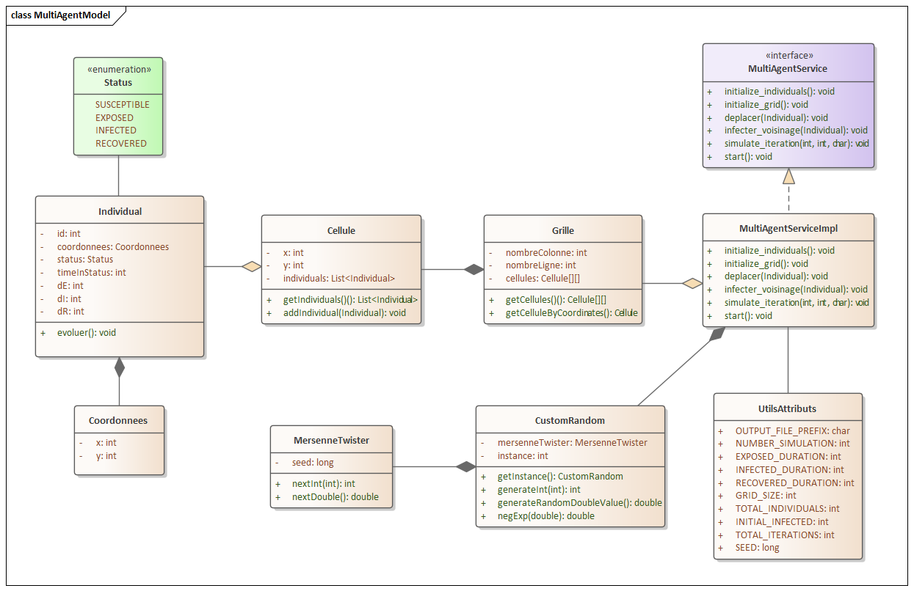
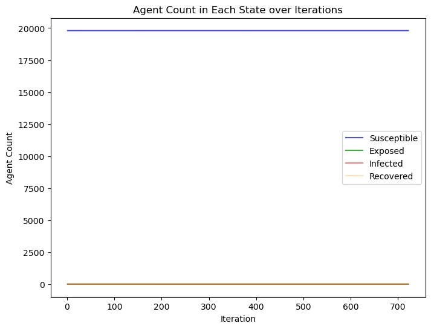

# Modèle Toy case SEIR multi-agent


## Contributeurs
* KABOURI Mouad
* MONJI Said
* SEDDIKI Ayoub
## PRNG
Le PRNG utilisé dans ce projet pour générer des nombres aléatoires est Mersenne Twister, l'un des générateurs de nombres pseudo-aléatoires les plus largement utilisés et respectés. Il se distingue par sa longue période de répétition, qui signifie qu'il génère un grand nombre de séquences de nombres avant de revenir à une séquence déjà produite.
## I-Objectif
L’objectif principal du projet est de développer un modèle multi-agent simple de propagation d'une maladie dans une population. 
## II-Structure du projet
Le projet contient principalement trois packages ``Models``, ``Services``, et ``utils``.
### 1-packages
#### 1-a) Le package Models 
Le package "models" contient des classes (Grille, Cellule, Individual, et Status) qui représentent des modèles de données dans l'application. Ces classes sont conçues pour encapsuler les données et le comportement associés à ces modèles.

#### 1-b) Le package Services
le package "Services" contient des classes qui encapsulent la logique métier de l'application et fournissent des services ou des fonctionnalités spécifiques.

#### 1-c) Le package Utils
Le package "utils" est  utilisé pour regrouper des classes utilitaires qui fournissent des fonctionnalités génériques et des méthodes réutilisables dans une application.

### 2-patron de conception

Dans ce projet, nous avons utilisé plusieurs design patterns pour améliorer la structure et la flexibilité de notre code. Voici une liste des design patterns utilisés :
#### 2-a) Singleton (Création) 
Le design pattern ``Singleton`` est un modèle de conception qui permet de s'assurer qu'une seule instance d'une classe est créée et fournit un point d'accès global à cette instance.

Exemple : L'instance de PRNG, et du service.

#### 2-b) Model en couches (Structure)
Ce patron permet d'organiser une application en différentes couches, chaque couche ayant une responsabilité spécifique. Chaque couche communique avec les couches adjacentes de manière hiérarchique et bien définie.

La structure de projet a été conçue de manière a faciliter la maintenance toute en respectant le principe d'ouverture a l'extension et fermé a la modification.

## III-Diagramme de classe



## IV-Jupyter notebook

```python
import pandas as pd

# Créer un DataFrame vide pour stocker les moyennes
result_df = pd.DataFrame()

# Lire les fichiers CSV et calculer les moyennes
for i in range(1, 100):
    filename = f"/content/drive/MyDrive/Data/results_{i}.csv"
    df = pd.read_csv(filename)
    if result_df.empty:
        result_df = df.copy()
    else:
        result_df += df

# Diviser par le nombre de fichiers pour obtenir les moyennes
result_df /= 100

# Écrire le DataFrame des moyennes dans un fichier CSV
result_df.to_csv("moyenne.csv", index=False)
# Extraire les données pour les axes x et y
x = result_df['iteration']
y_s = result_df['susceptible']
y_e = result_df['exposed']
y_i = result_df['infected']
y_r = result_df['recovered']

# Créer une figure
fig, ax = plt.subplots(figsize=(8, 6))

# Tracer chaque ligne sur le même graphique avec des couleurs et des légendes
ax.plot(x, y_s, label='Susceptible', color='blue', alpha=0.7)
ax.plot(x, y_e, label='Exposed', color='green', alpha=0.7)
ax.plot(x, y_i, label='Infected', color='red', alpha=0.5)
ax.plot(x, y_r, label='Recovered', color='orange', alpha=0.3)

# Ajouter une légende et un titre au graphique
ax.set_xlabel('Iteration')
ax.set_ylabel('Agent Count')
ax.set_title('Agent Count in Each State over Iterations')
ax.legend()

# Afficher le graphique
plt.show()
```

